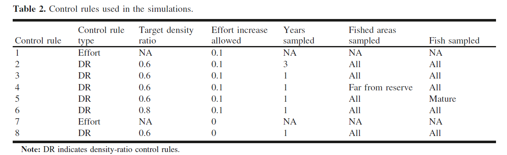
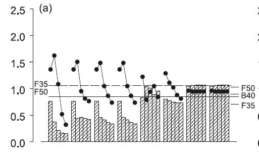

```{r, include = FALSE}
knitr::opts_chunk$set(
  collapse = TRUE,
  comment = "#>"
)
```

```{r, echo = FALSE, output = FALSE, warning = FALSE, message = FALSE}
library(remotes)
remotes::install_github('vquennessen/densityratio')
library(densityratio)
library(abind)
library(ggplot2)
```

# Introduction

Historically, fisheries management has relied on knowing a stock's unfished biomass. Then, if the estimated stock biomass is below the target biomass, fishing effort is allowed to increase; if not, effort is decreased to allow the biomass to rebuild. However, there is one major issue with this system - the unfished biomass of a fished stock is difficult to estimate, and requires a long time series of catch and abundance data. For smaller, newer, or data-poor fisheries, this can make estimations very inaccurate and lead to mismanagement. A decade ago, a new reference point was proposed by Drs. Babcock and MacCall, called the density ratio - with only 1 year of sampling, this reference point could allow for the adaptive management of even small, new, or data-poor stocks. 

However, another problem that is not addressed using this new reference point is the time it takes for populations inside recently implemented reserves to start to build back up and the population dynamics that are associated with this transition. 

For this project, I will replicate the results of her model, and then compare one of Dr. Babcock's most successful control rule with a new control that takes these transient dynamics into account. 

## Set the parameters that are the same for all scenarios

### These parameters are the same for all the simulations
```{r}
# Species
Species = 'BR_CA_2003'
# set arguments
R0 = 1e+5
A = 5
MPA = 3
Time1 = 50
Time2 = 50
M_Error = 0
Sampling_Error = FALSE
Stochasticity = FALSE
Surveys = TRUE
Fishery_management = TRUE
Fishing = TRUE
Transects = 24
Final_DRs = c(1)
Floor_DR = 0.2
Years_sampled = NULL
Areas_sampled = NULL
Ind_sampled = NULL
BM = TRUE
Output.N = FALSE
Output.Abundance = FALSE
Output.Biomass = FALSE
Output.SSB = TRUE
Output.Yield = TRUE
Output.Effort = FALSE
Output.Density.Ratio = FALSE
```

\newpage

# Run the scenarios across all recruitment modes, adult movemement rates, and effort allocations. 
```{r, cache = TRUE}
Rmodes <- c('closed', 'regional_DD', 'local_DD', 'pool', 'closed')
LDPs <- c(0, 0, 0, 0, 0.10)
Adult_M <- c(TRUE, FALSE)
Allocations <- c('IFD', 'equal')
S <- length(Rmodes) * length(Adult_M) * length(Allocations)

for (r in 1:length(Rmodes)) {
  for (am in 1:length(Adult_M)) {
    for (a in 1:length(Allocations)) {
      
      LDP <- LDPs[r]
      Recruitment_mode <- Rmodes[r]
      Adult_movement <- Adult_M[am]
      Allocation <- Allocations[a]
      
      output <- base_model(Species, R0, A, MPA, Time1, Time2, 
                           Recruitment_mode, M_Error, Sampling_Error, 
                           Stochasticity, Surveys, Fishery_management, Fishing, 
                           Transects, Adult_movement, Final_DRs, Years_sampled, 
                           Areas_sampled, Ind_sampled, Floor_DR, Allocation, BM,
                           LDP, Output.N, Output.Abundance, Output.Biomass, 
                           Output.SSB, Output.Yield, Output.Effort, 
                           Output.Density.Ratio)
      
    # save the relative SSB and yield as a sum across all areas, 
    # times after reserve implementation, control rules, and scenarios
    if (r == 1 && am == 1 && a == 1) {
      sims_SSB <- colSums(output$SSB)
      sims_yield <- output$Yield
      sims_effort <- output$Effort
    } else { 
      sims_SSB <- abind(sims_SSB, colSums(output$SSB), along = 3)
      sims_yield <- abind(sims_yield, output$Yield, along = 3)
      sims_effort <- abind(sims_effort, output$Effort, along = 3) }
    }
  }
}
```

\newpage

# Calculate the average SSB at the end of each decade and the average yield across decades
```{r}
# end of decade years
years <- seq(11, 51, by = 10)
decades <- 1:length(years)
Control_rules <- 1:11

# initialize data frame
data <- data.frame(Control.Rule = rep(Control_rules, each = length(decades)),
                   Index = 1:(length(Control_rules)*length(decades)),
                   Decade = rep(decades, times = length(Control_rules)),
                   SSB = rep(0, length(Control_rules)*length(decades)), 
                   yield = rep(0, length(Control_rules)*length(decades)))

# initialize relative SSB and yield arrays
rel_SSB <- array(rep(0, (Time2 + 1)*length(Control_rules)*S),
                 c(Time2 + 1, length(Control_rules), S))
rel_yield <- array(rep(0, (Time2 + 1)*length(Control_rules)*S),
                 c(Time2 + 1, length(Control_rules), S))
# calculate relative SSB and yield
for (t in 1:(Time2 + 1)) {
  for (cr in 1:length(Control_rules)) {
    for (s in 1:S) {
      rel_SSB[t, cr, s] <- sims_SSB[t, cr, s] / sims_SSB[1, cr, s]
      rel_yield[t, cr, s] <- sims_yield[t, cr, s] / sims_yield[1, cr, s]
    }
  }
}

# fill in average SSB at the end of decades and yield across decades
for (cr in 1:length(Control_rules)) {
  for (d in 1:length(decades)) {
    index <- (cr - 1)*length(decades) + d
    data$SSB[index] <- mean(rel_SSB[years[d], cr, ])
    data$yield[index] <- mean(rel_yield[(years[d] - 10):years[d], cr, ])
  }
}
```

\newpage

# Control rules


# original results

\newpage

# replicate original results - Figure 4(a) from Babcock & MacCall 2011
```{r}
OG <- subset(data, Control.Rule <= 8)

# plot Figure 4a
ggplot(OG, aes(x = Decade, y = SSB, fill = as.factor(Control.Rule))) + 
  geom_bar(stat = 'identity') +
  facet_grid(cols = vars(Control.Rule)) +
  geom_path(aes(x = Decade, y = yield)) +
  geom_point(aes(x = Decade, y = yield)) +
  labs(fill = 'Control Rule') + 
  theme(legend.position = 'none') +
  theme(axis.text.x = element_blank()) + 
  theme(axis.title.x = element_blank()) + 
  theme(axis.ticks.x = element_blank())
```
While control rules 7 and 8 show a consistely high biomass, this is because they don't allow fishing effort to increase. 

\newpage

# new control rules
```{r}
NEW <- subset(data, Control.Rule %in% c(6, 9, 10, 11))
FDRs <- c('NA', '0.7', '0.8', '0.9')

# plot Figure 4a
ggplot(NEW, aes(x = Decade, y = SSB, fill = as.factor(Control.Rule))) + 
  geom_bar(stat = 'identity') +
  facet_grid(cols = vars(Control.Rule)) +
  geom_path(aes(x = Decade, y = yield)) +
  geom_point(aes(x = Decade, y = yield)) +
  labs(fill = 'Control Rule') + 
  scale_fill_discrete(name = 'FDRs', labels = c('NA', '0.7', '0.8', '0.9')) +
  theme(axis.text.x = element_blank()) + 
  theme(axis.title.x = element_blank()) + 
  theme(axis.ticks.x = element_blank()) 
```
